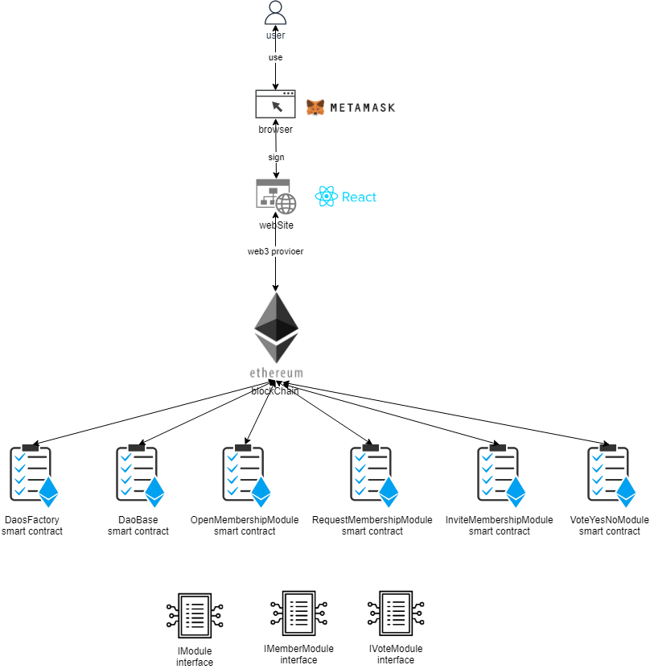

# Design Pattern Decisions

# Factory design pattern

Each DAO has his own smart contract deployed. For that use, we used a factory "DaosFactory" to deploy on demand a "DAOBase" smart contract, and keep track of all of them.
"DaosFactory" is responsible also for creating Daos Modules smart contracts and tracking them.

# Dependency inversion principle

We put a layer of abstraction between our smarts contracts to make our system extensible and well decoupled, in order to easily add new modules for example.
A Dao Factory as well as a DAO do not know the implementations of modules for example, but handle only the IModule interface, which all modules implement.
Modules can have dependencies between them. Modules also only handle interfaces of type Module.
Example: voting module needs a membership module to access and verify that voters are members. It manipulates the IMemberDao interface that all Membership type modules implement. In this way, regardless of the module chosen to manage membership, the Vote module manages to communicate with it, without knowing it. Tomorrow we could easily add a new membership module (NFT), and the voting system could communicate with it, and this without modifying the voting module.


<p align="center">

</p>


# Hash

We used a hashing string pattern.

Here is the code used in the DaoFactory :

```js
/**
  * @notice create a bytes8 hash
  * @param _name: string to hash
  * @return bytes8 hash
  */
  function hash(string memory _name) external pure returns(bytes8) {
    return (bytes8(keccak256(abi.encode(_name))));
  }
```
# Fail early and fail loud

We tried to check as much possible inputs and behavior to throw exception before the code is executed. Two controls, on front side and smart contracts side.

Example:
On creation DAO, name is required.

Front side:

```js
export const validationSchema = yup.object({
    name: yup
      .string()
      .required('Name can\'t be empty'),
  });
```
Smart contract side: 
```js
/**
  * @notice create a new dao and store in DaosFactory
  * @param _name: the dao name
  * @param _description: the dao description
  * @param _visibility: the visibility see ./Data.sol
  * @param _rules: the dao rules
  * @param _modules: array of modules type and code hash to add 
  */
  function createDAO(
    string calldata _name,
    string calldata _description,
    Data.visibilityEnum _visibility,
    string memory _rules,
    Data.ModuleToActivate[] memory _modules
  )
    public
  {
    require(_modules.length < 10, "Modules must be less than 10.");
    require(bytes(_name).length != 0, "Name can not be empty");    
    deployedDao memory _dao;
    DaoBase dao = new DaoBase(_name, _description, _visibility, _rules);
    dao.authorizeContract(address(this));
    dao.transferOwnership(msg.sender);
    _dao.owner = msg.sender;
    _dao.daoAddress = address(dao);
    daos.push(_dao);

    for(uint i=0; i < _modules.length; ++i) {
      require(modulesDaos[_modules[i].moduleType][_modules[i].moduleCode].isActive == true, "Module not found");
      _activateModuleForDao(
        address(dao),
        _modules[i].moduleType,
        _modules[i].moduleCode
      );
    }
    daoOwners[address(dao)][msg.sender] = true;
    emit DaoCreated(msg.sender, _name, _dao.daoAddress);
  }
```
# Ownership access control

- We are using OpenZeppelin Ownable contract to ownership of smart contracts.
- We have created also our ownership authorized whitelist to manage access controls.

# Guard Check
We make extensive use of "modifier" and "require" to check that all conditions are met to safely execute a function. In our functions, checks are performed first. In a second step, if all the checks have succeeded, the effects on the state variables of the current contract are carried out

# Checks Effects Interactions
As soon as a function offers the possibility of token transfer, we must ensure that there is no re-entrancy exploit risk.
We have used ReentrancyGuard de OpenZipelin:
https://docs.openzeppelin.com/contracts/2.x/api/utils

# Tight Variable Packing
Solidity smart contracts have contiguous 32-byte (256-bit) slots used for storage. When we arrange variables so that several of them fit in a single location, it is called “variable packing”. Please note, we are talking about a specific type, for example a uint128 is not of the same type as a uint256

# State Machine
We applied this pattern to our smarts contracts to control the state of their elements and enable or disable actions under certain circumstances (example: disable vote voter if vote state is terminated).

# Solidity version
We have decided to use to 0.8.9 since OpenZeppelin supports it.

# Sources
- https://fr.wikipedia.org/wiki/Inversion_des_d%C3%A9pendances
- https://fravoll.github.io/solidity-patterns/
- https://docs.soliditylang.org/en/v0.8.11/common-patterns.html